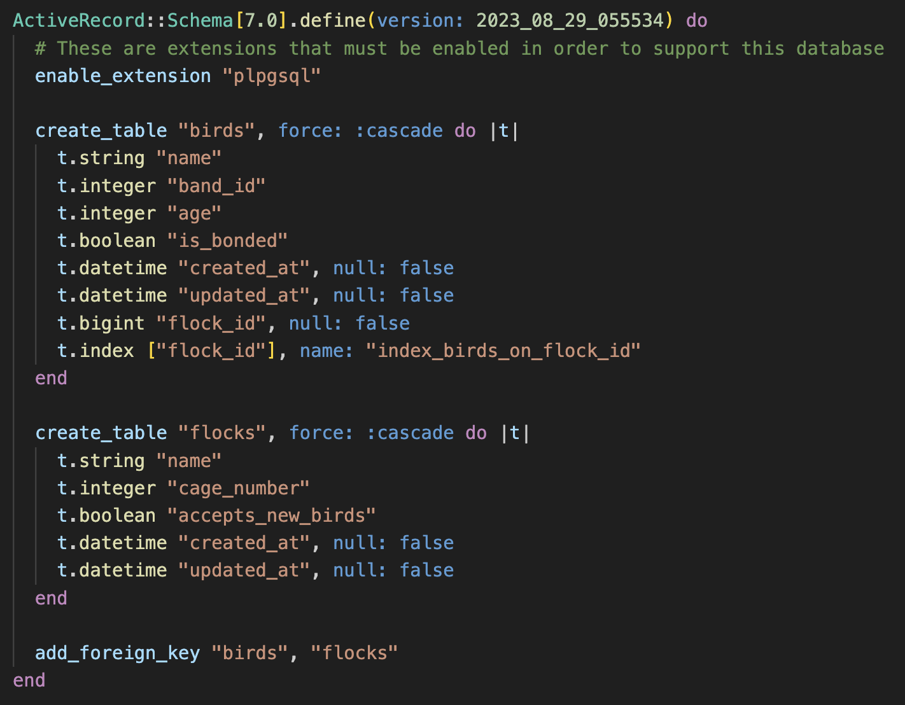

# README

## Relational Rails -- Flock Manager
It turns out, birds are picky. Shelters and carehomes for surrendered birds often face a great battle of giving their birds enough social diversity, while keeping all members of a flock safe - some accept new birds, others don't. Flock Manager is a (very simple) tool to manage the relationships of birds to their flocks, flock status, etc. 

Relational Rails is a practice project for Mod 2 of Turing, with an expectation of creating a simple webapp to handle CRUD of a parent:child relationship. The app is on a Rails framework, with a postgresql database.

## Database Design
Flock Manager runs on a postgresql database, with only two tables:
- Birds - id (pk), name, band_id, age, is_bonded, flock_id (fk -> flocks.id)
- Flocks - id (pk), name, cage_number, accepts_new_birds

### Visual

### Schema

## User Stories
### Iteration 1
**CRUD** 

[X]
User Story 1, Parent Index 

For each parent table
As a visitor
When I visit '/parents'
Then I see the name of each parent record in the system 

[X]
User Story 2, Parent Show 

As a visitor
When I visit '/parents/:id'
Then I see the parent with that id including the parent's attributes
(data from each column that is on the parent table) 

[X] User Story 3, Child Index 

As a visitor
When I visit '/child_table_name'
Then I see each Child in the system including the Child's attributes
(data from each column that is on the child table) 

[X] User Story 4, Child Show 

As a visitor
When I visit '/child_table_name/:id'
Then I see the child with that id including the child's attributes
(data from each column that is on the child table) 

[X] User Story 5, Parent Children Index 

As a visitor
When I visit '/parents/:parent_id/child_table_name'
Then I see each Child that is associated with that Parent with each Child's attributes
(data from each column that is on the child table) 

**ActiveRecord** 

[X] User Story 6, Parent Index sorted by Most Recently Created 

As a visitor
When I visit the parent index,
I see that records are ordered by most recently created first
And next to each of the records I see when it was created 

[X] User Story 7, Parent Child Count

As a visitor
When I visit a parent's show page
I see a count of the number of children associated with this parent 

**Usability** 

[X] User Story 8, Child Index Link

As a visitor
When I visit any page on the site
Then I see a link at the top of the page that takes me to the Child Index 

[X] User Story 9, Parent Index Link

As a visitor
When I visit any page on the site
Then I see a link at the top of the page that takes me to the Parent Index 

[X] User Story 10, Parent Child Index Link

As a visitor
When I visit a parent show page ('/parents/:id')
Then I see a link to take me to that parent's `child_table_name` page ('/parents/:id/child_table_name') 

### Iteration 2
**CRUD** 

[X] User Story 11, Parent Creation 

As a visitor
When I visit the Parent Index page
Then I see a link to create a new Parent record, "New Parent"
When I click this link
Then I am taken to '/parents/new' where I  see a form for a new parent record
When I fill out the form with a new parent's attributes:
And I click the button "Create Parent" to submit the form
Then a `POST` request is sent to the '/parents' route,
a new parent record is created,
and I am redirected to the Parent Index page where I see the new Parent displayed. 

[X] User Story 12, Parent Update 

As a visitor
When I visit a parent show page
Then I see a link to update the parent "Update Parent"
When I click the link "Update Parent"
Then I am taken to '/parents/:id/edit' where I  see a form to edit the parent's attributes:
When I fill out the form with updated information
And I click the button to submit the form
Then a `PATCH` request is sent to '/parents/:id',
the parent's info is updated,
and I am redirected to the Parent's Show page where I see the parent's updated info 

[X] User Story 13, Parent Child Creation 

As a visitor
When I visit a Parent Children Index page
Then I see a link to add a new adoptable child for that parent "Create Child"
When I click the link
I am taken to '/parents/:parent_id/child_table_name/new' where I see a form to add a new adoptable child
When I fill in the form with the child's attributes:
And I click the button "Create Child"
Then a `POST` request is sent to '/parents/:parent_id/child_table_name',
a new child object/row is created for that parent,
and I am redirected to the Parent Childs Index page where I can see the new child listed 

[X] User Story 14, Child Update 

As a visitor
When I visit a Child Show page
Then I see a link to update that Child "Update Child"
When I click the link
I am taken to '/child_table_name/:id/edit' where I see a form to edit the child's attributes:
When I click the button to submit the form "Update Child"
Then a `PATCH` request is sent to '/child_table_name/:id',
the child's data is updated,
and I am redirected to the Child Show page where I see the Child's updated information 

**ActiveRecord** 

[X] User Story 15, Child Index only shows `true` Records 

As a visitor
When I visit the child index
Then I only see records where the boolean column is `true` 

[X] User Story 16, Sort Parent's Children in Alphabetical Order by name 

As a visitor
When I visit the Parent's children Index Page
Then I see a link to sort children in alphabetical order
When I click on the link
I'm taken back to the Parent's children Index Page where I see all of the parent's children in alphabetical order 

**Usability** 

[X] User Story 17, Parent Update From Parent Index Page 

As a visitor
When I visit the parent index page
Next to every parent, I see a link to edit that parent's info
When I click the link
I should be taken to that parent's edit page where I can update its information just like in User Story 12 

[X] User Story 18, Child Update From Childs Index Page 

As a visitor
When I visit the `child_table_name` index page or a parent `child_table_name` index page
Next to every child, I see a link to edit that child's info
When I click the link
I should be taken to that `child_table_name` edit page where I can update its information just like in User Story 14 

### Iteration 3
**CRUD** 

[X] User Story 19, Parent Delete 

As a visitor
When I visit a parent show page
Then I see a link to delete the parent
When I click the link "Delete Parent"
Then a 'DELETE' request is sent to '/parents/:id',
the parent is deleted, and all child records are deleted
and I am redirected to the parent index page where I no longer see this parent 

[X] User Story 20, Child Delete 

As a visitor
When I visit a child show page
Then I see a link to delete the child "Delete Child"
When I click the link
Then a 'DELETE' request is sent to '/child_table_name/:id',
the child is deleted,
and I am redirected to the child index page where I no longer see this child 

**ActiveRecord** 

[X] User Story 21, Display Records Over a Given Threshold 

As a visitor
When I visit the Parent's children Index Page
I see a form that allows me to input a number value
When I input a number value and click the submit button that reads 'Only return records with more than `number` of `column_name`'
Then I am brought back to the current index page with only the records that meet that threshold shown. 

**Usability** 

[X] User Story 22, Parent Delete From Parent Index Page 

As a visitor
When I visit the parent index page
Next to every parent, I see a link to delete that parent
When I click the link
I am returned to the Parent Index Page where I no longer see that parent 

[X] User Story 23, Child Delete From Childs Index Page 

As a visitor
When I visit the `child_table_name` index page or a parent `child_table_name` index page
Next to every child, I see a link to delete that child
When I click the link
I should be taken to the `child_table_name` index page where I no longer see that child 

### Extensions

[X] Extension 1: Sort Parents by Number of Children 

As a visitor
When I visit the Parents Index Page
Then I see a link to sort parents by the number of `child_table_name` they have
When I click on the link
I'm taken back to the Parent Index Page where I see all of the parents in order of their count of `child_table_name` (highest to lowest) And, I see the number of children next to each parent name 

[ ] Extension 2: Search by name (exact match)

As a visitor
When I visit an index page ('/parents') or ('/child_table_name')
Then I see a text box to filter results by keyword
When I type in a keyword that is an exact match of one or more of my records and press the Search button
Then I only see records that are an exact match returned on the page 

[ ] Extension 3: Search by name (partial match)

As a visitor
When I visit an index page ('/parents') or ('/child_table_name')
Then I see a text box to filter results by keyword
When I type in a keyword that is an partial match of one or more of my records and press the Search button
Then I only see records that are an partial match returned on the page

This functionality should be separate from your exact match functionality.